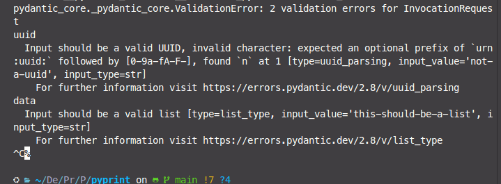
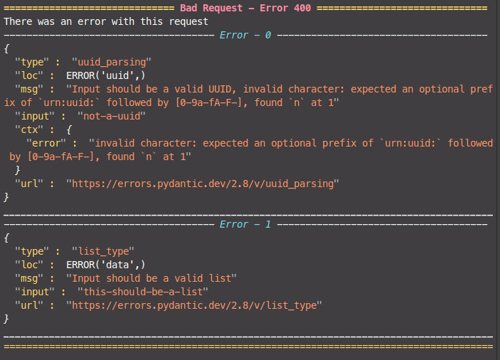
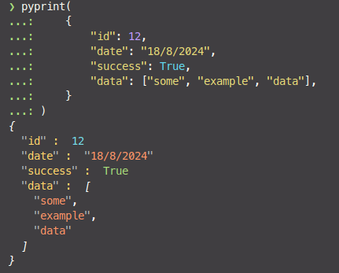
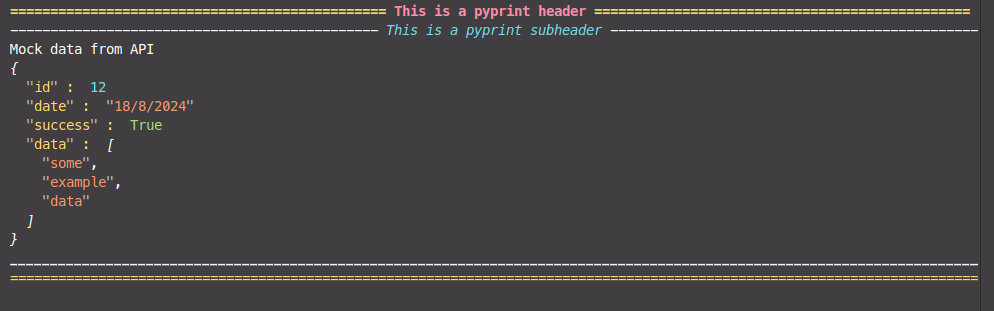
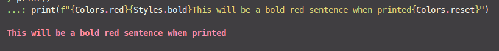
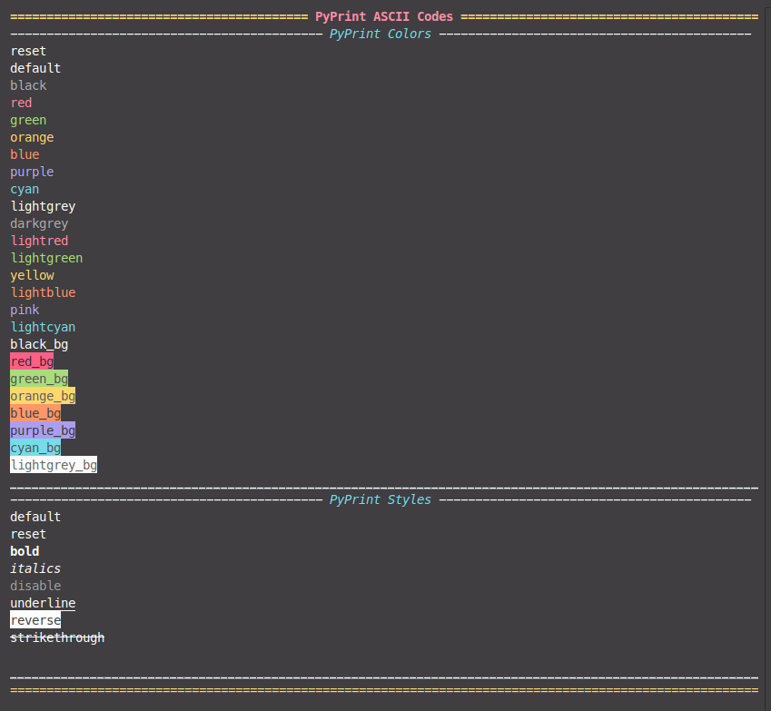
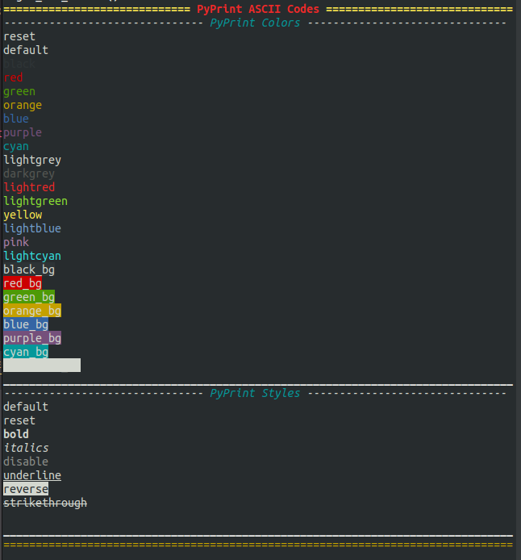

# PyPrint
Pyprint is a package designed around making it easy for you to do printing tasks such as printing, logging, debugging, error handling etc.
The easy creation of headers, footers, coloured output for data structures allow for an easier time creating and viewing these logs.

This allows you and your team to more easily investigate and digest code output in the terminal with minimal effort.




## Install
```
python -m pip install git+https://github.com/djhardy99/pyprint
```

## How to use

### Printing objects
pyprint as a method takes a single native python object and prints it stylised. There is an optional argument to instead return the stylised string with ascii encoding should you desire.

Currently supports
- Text Type: str
- Numeric Types: int, float, complex
- Boolean Type: bool
- Binary Types: bytes
- None Type: NoneType
- Collection Types: List, Dict, Set
```
from pyprint import pyprint

pyprint(
    {
        "id": 12,
        "date": "18/8/2024",
        "success": True,
        "data": ["some", "example", "data"],
    }
)

pyprint(example_dict)
```

### Printing Section Components
There is also functionality to print headers, subheaders, subfooters and footers to split print statements up.

```
from pyprint.components import (
  pyprint_header,
  pyprint_subheader,
  pyprint_subfooter,
  pyprint_footer
)
pyprint_header("This is a pyprint header")
pyprint_subheader("This is a pyprint subheader")
print("Mock data from API")
pyprint(
    {
        "id": 12,
        "date": "18/8/2024",
        "success": True,
        "data": ["some", "example", "data"],
    }
)
pyprint_subfooter()
pyprint_footer()

```

### Creating Custom Outputs
Pyprint includes a reference to the ASCII colors and styling codes which you can use alongside the premade components and data parsing for your own liking.
```
from pyprint.colors import Colors,Styles
print()
print(f"{Colors.red}{Styles.bold}This will be a bold red sentence when printed{Colors.reset}")
```

## Custom Output
If you are using a terminal theme, the colors may not match the ASCII color scheme. This is to be expected. A handy way to check how the colors will actually look is to run the get_all_colors() method.

All variables are accessed through a property such as Colors.red or Styles.bold.

Note:
- default: This is your terminals normal text output. Actual value is a Literal[""]
- reset: This is a special character in ASCII that resets your terminal styling to the default.
```
from pyprint.utils import get_all_colors
get_all_colors()
```

